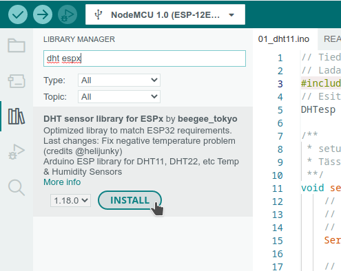
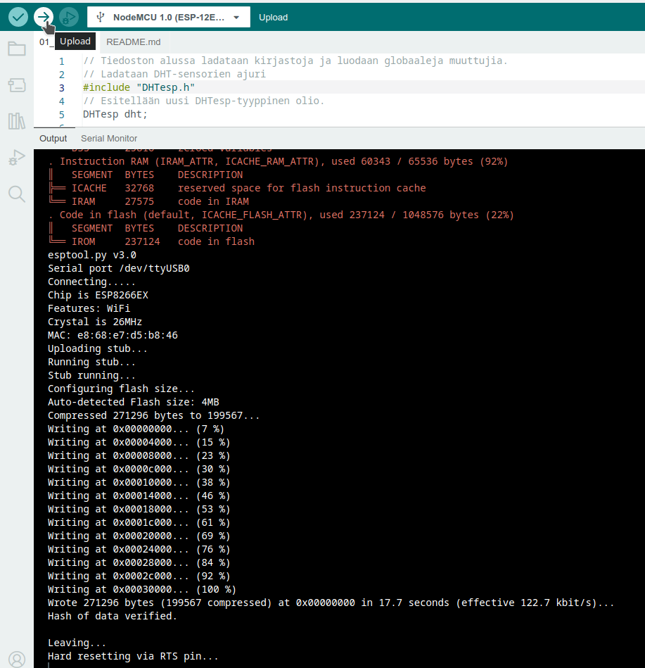
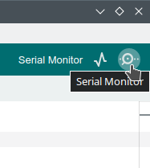
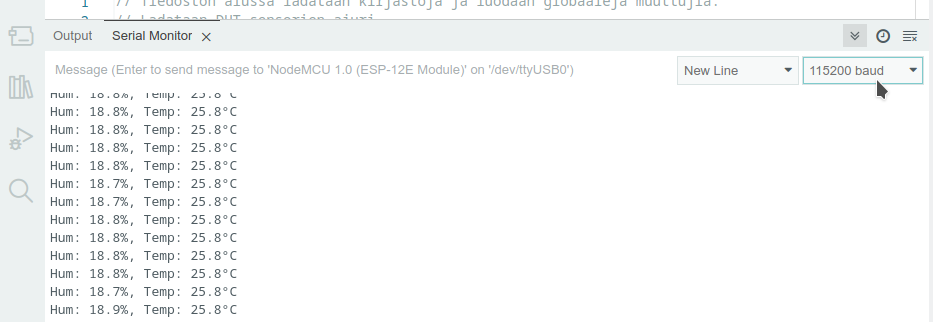

# DHT11-sensori

Tämä ohjelma on yksinkertainen ja havainnollistaa samalla
Arduino IDE:llä tehdyn ohjelman rakennetta sekä DHT11-sensorin
käyttöä. Aluksi täytyy kuitenkin asentaa tarvittava kirjasto.

## Kirjaston asentaminen

Jotta voimme käyttää DHT11-sensoria, Arduino IDE:en pitää ensin asentaa
kirjasto, jossa ovat tarvittavat toiminnallisuudet sensorin käyttämiseen.

Avataan vasemmasta reunasta "Library Manager" ja kirjoitetaan hakusanaksi "dht espx"
sekä asennetaan hakutuloksena löytyvä kirjasto. Tämän jälkeen kirjastoa voi käyttää
ohjelmassa lataamalla se komennolla `#include "DHTesp"`.



## Ohjelman rakenne

Ohjelma koostuu kolmesta osasta:
1. Alussa ladataan kirjastoja `#include` -komennoilla ja määritellään globaaleja
   muuttujia, joita käytetään koko ohjelman alueella.
2. `setup()` -funktio suoritetaan kerran, kun mikro-kontrolleri käynnistyy.
   Tässä funktiossa tehdään erilaisia alustuksia, jotka on tarkoitus tehdä vain kerran.
   Esimerkiksi sensorin alustus, verkkoyhteyden luonti yms.
3. `loop()` -funktio suoritetaan `setup()` -funktion suorituksen jälkeen toistuvasti
   yhä uudelleen ja uudelleen. Siihen laitetaan toiminnot, jotka ovat tehdyn laitteen
   varsinainen toiminto. Tässä siis luetaan toistuvasti sensoreita, päivitetään näyttöä,
   viestitään verkkoon jne. `loop()`-funktion lopussa on usein `delay(x)`-komento, jolla
   ohjelma saadaan odottamaan `x` millisekuntia ennen seuraavan kierroksen aloittamista.

## DHT11-sensorin käyttö

DHT-sensoria käsittelevä kirjasto otetaan käyttöön komennolla
```c++
#include "DHTesp.h"
```

Kirjastossa on määritelty `DHTesp`-tyyppi, jolla voidaan lukea sensoria.
Luodaan uusi tätä tyyppiä oleva muuttuja rivillä:
```c++
DHTesp dht
```

Tämä luotu `dht`-muuttuja alustetaan `setup()`-metodilla, jossa sille kerrotaan,
mihin NodeMCU:n pinniin (`D6`) sensori on kytketty ja minkä tyyppinen (`DHTesp::DHT11`) sensori on kyseessä. Tämän jälkeen tätä muuttujaa voidaan käyttää kyseisen sensorin
arvojen lukemiseen. Jos sensoreita olisi useita, voitaisiin luoda useampi 
`DHTesp`-tyyppinen muuttuja ja alustaa kukin lukemaan NodeMCU:n eri pinneihin kytkettyjä
sensoreita. Muuttujan asetusten alustus tehdään `setup()`-funktiossa, koska se tehdään
vain kerran.

Lämpötila ja ilmankosteus luetaan sensorista toistuvasti `loop()`-funktion sisällä.
Nämä luetaan `dht`-muuttujan metodeilla `dht.getTemperature()` ja `dht.getHumidity()`.
Lämpötila on Celsius-asteita ja molemmat saadut tulokset asetetaan `float` tyyppiseen
muuttujaan.


## Sarjatulostus

Tässä yksinkertaisessa ohjelmassa ei ole vielä muuta paikkaa tulostaa saatuja
mittausarvoja, joten tulostetaan ne sarjatulostukseen, eli `Serial`-objektiin,
johon tulostettuja tekstejä voidaan seurata Arduino IDE:n "Serial Monitor" -näkymässä.

`Serial`-olio alustetaan kertomalla sille haluttu tiedonsiirtonopeus (NodeMCU:n ja tietokoneen välillä) komennolla:
```c++
Serial.begin(115200)
```
Tämä on suositeltu nopeus ja sama nopeus pitää valita "Serial Monitoriin".

Tulostuksen voi tehdä komennoilla:
```c++
Serial.print("Tekstiä, ei rivinvaihtoa loppuun.");
Serial.println("Teksti ja lopuksi rivinvaihto.");
Serial.printf("Tekstiä, muuttujan paikkoja %s, %d, %.0f muotoiluineen.", var1, var2, var3);
```
Viimeisessä vaihtoehdossa tekstin seassa on paikkoja eri tyyppisille muuttujille
ja niiden mahdollisia muotoiluja sekä lopuksi niiden paikoille sijoitettavat muuttujat.


## Kääntäminen ja siirtäminen

Kun ohjelma on valmis, sen voi ensin tarkistaa "Verify"-napilla, joka varmistaa, että
ohjelman syntaksi on oikein ja kaikki viitatut tiedostot löytyvät.

Lopuksi "Upload"-napilla ohjelma käännetään ja siirretään mikro-kontrolleriin.
Kun prosenttilukuja laskevat "Writing at..." rivit pääsevät sataan prosenttiin, siirto
on valmis ja NodeMCU alkaa suorittaa ohjelmaa.



Serial Monitor, josta tulostuksia voi seurata, avautuu napauttamalla Arduino IDE:n
oikeassa yläkulmassa olevaa nappia.



Serial Monitoriin tulostuvat nyt sensorista luetut arvot.
Jos monitoriin tulee sekalaisia outoja merkkejä, kannattaa varmistaa, että
siirtonopeus on oikea, eli sama kuin ohjelmassa valittu 115200 baudia.


