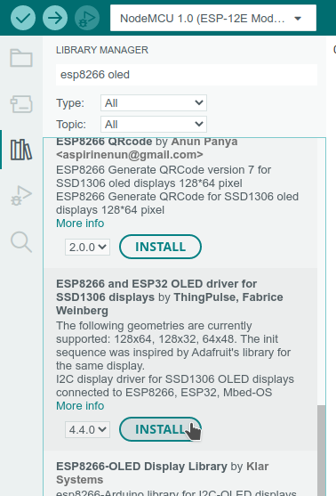
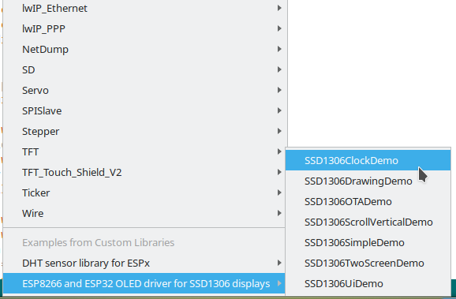

# OLED 128×64 -näyttö

Ohjeet 4-pinnisen i2c-protokollalla toimivan SSD1306-oled-näytön ohjelmoimisesta.

Ohjeet näytön kytkemisestä olivat [pääsivulla](../).

Tämä ohjelma havainnollistaa muutaman tärkeimmän toiminnon, joilla näyttöön saadaan piirrettyä
ja kirjoitettua asioita. Ensin ohjelmassa ladataan käyttöön tarvittavat kirjastot,
luodaan `display`-muuttuja, joka yhdistetään kytkettyyn näyttöön kertomalla käytetyt pinnit ja
jonka metodeilla näytön sisältöä päivitetään.

## Kirjastojen asentaminen

Etsitään "Library Manager" -näkymästä hakusanoilla "esp8266 oled" tarvittava kirjasto,
joka on ThingPulsen tekemä ajuri SSD1306 oled-näytölle.



## Ohjelman rakenne

Ohjelman rakenne on seuraava:
- Ohjelman alussa ladataan käytettävät kirjastot.
    - `#include <Wire.h>` lataa kirjaston I2C-protokollan käyttämiseen.
    - `#include "SSD1306Wire.h"` lataa kirjaston, jolla näyttöä voi käyttää I2C:n avulla.
    - `#include "images.h"` lataa itse tehdyn tiedoston, jossa on muutama kuva xbm-muodossa.
- Määritellään muutama vakio, tyyppi ja globaali muuttuja, joita käytetään ohjelmassa.
    - `DEMO_DURATION` kertoo, montako millisekuntia kutakin näkymää näytetään näytöllä.
    - `demoNumber` on laskuri, jolla valitaan näytettävä demo.
    - `counter` laskee suoritetut `loop()`-funktion kierrokset. Käytetään edistymispalkin piirtämisessä.
- Määritellään muutama piirtofunktio, joista kukin esittelee joitain piirto-ominaisuuksia.
    - `drawText()` esittelee tekstin kirjoittamista näytölle.
    - `drawFigures()` esittelee ympyröiden, suorakaiteiden yms. piirtämistä.
    - `drawImages()` piirtää xbm-kuvia.
    - `drawProgressBar()` esittelee metodin, jolla voi piirtää edistymistä kuvaavan palkin.
- `setup()`-funktio alustaa alkuasetukset.
- `loop()`-funktio piirtää näyttöä yhä uudelleen ja tasaisin väliajoin vaihtaa
   käytettävän piirtofunktion.


## Piirtokomennot

Ensin luodaan `display`-objekti komennolla:
```c++
SSD1306Wire  display(0x3c, D3, D4);
```

Objekti on tyyppiä `SSD1306Wire`, eli I2C-protokollaa käyttävä SSD1306-näyttö.
Objekti alustetaan kertomalla sille laitteen osoite (`0x3c`) sekä pinnit, joihin se on
kytketty (`D3` ja `D4`).

Tärkeimmät näyttöä ohjaavat metodit ovat:

| Metodi        | Tarkoitus                         |
|---------------|-----------------------------------|
| `clear()`     | Tyhjentää näytön.                 |
| `setColor(WIHTE)`| Asettaa piirtoväriksi valkoisen. |
| `setFont(ArialMT_Plain_10)`   | Asettaa käytettävän fontiksi 10 pikselin Arial-fontin.      |
| `setTextAlignment(TEXT_ALIGN_LEFT)` | Tekstin asettelun referenssipisteen suhteen. |
| `drawString(x, y, "Teksti")` | Kirjoittaa tekstin kohtaan (x,y). |
| `drawCircle(x, y, r)` | Piirtää ympyrän. Keskipiste (x,y), säde r. |
| `drawRect(x, y, w, h)`| Piirtää suorakaiteen. Vasen yläkulma (x,y), leveys w ja korkeus h. |
| `fillRect(x, y, w, h)`| Piirtää täytetyn suorakaiteen. Vasen yläkulma (x,y), leveys w ja korkeus h. |
| `drawHorizontalLine(x, y, w)` | Piirtää vaakasuoran viivan. Alkupiste (x,y), pituus w. |
| `drawVerticalLine(x, y, w)` | Piirtää pystysuoran viivan. Alkupiste (x,y), pituus w. |
| `setPixel(x, y)` | Piirtää pisteen kohtaan (x, y) |
| `drawXbm(x, y, w, h, bits)` | Piirtää xbm-kuvan kohtaan (x,y), leveys w, korkeus h ja pikselit taulukossa bits.|
| `drawProgressBar(x, y, w, h, p)` | Piirtää edistymispalkin paikkaan (x,y), leveys w, korkeus h ja edistyminen p prosenttia.|
| `display()`   | Piirtää piirtokomennoilla valmistellun näkymän näytölle. |

Laajempi kuvaus kirjaston näyttöä ohjaavista toiminnoista löytyy osoitteesta https://github.com/ThingPulse/esp8266-oled-ssd1306 .

Sivulla kuvaillaan mm. näytön kirkkauden ja kontrastin säätäminen sekä lisää piirtometodeja.


## Lisää esimerkkejä

Lisää esimerkkejä näytön ohjelmoimisesta tällä kirjastolla löytyy kirjaston
asentamisen jälkeen Arduino IDE:n "Tiedosto"-valikon esimerkeistä.



## Xbm-kuvat

Xbm-kuvat ovat yksinkertaisia bittikarttakuvia. Niitä voi piirtää
vaikka [Gimp-kuvankäsittelyohjelmalla](https://www.gimp.org/)
ja tallentaa sen "Vie nimellä..."-toiminnolla
valitsemalla tallennusmuodoksi xbm.

Kuvat ovat käytännössä tekstitiedostoja, joissa on c++-koodia, joka määrittelee
kuvan leveyden, korkeuden sekä pikselien värit.

Alla esimerkkikuva:
```c++
#define heart_width 32
#define heart_height 30
static unsigned char heart_bits[] = {
   0xc0, 0x0f, 0xf0, 0x03, 0xb0, 0x38, 0x3c, 0x0e, 0x18, 0x60, 0x06, 0x18,
   0x04, 0xc0, 0x03, 0x20, 0x06, 0x80, 0x01, 0x60, 0x02, 0x80, 0x01, 0x40,
   0x03, 0x00, 0x00, 0xc0, 0x01, 0x00, 0x00, 0x80, 0x01, 0x00, 0x00, 0x80,
   0x01, 0x00, 0x00, 0x80, 0x03, 0x00, 0x00, 0xc0, 0x03, 0x00, 0x00, 0xc0,
   0x02, 0x00, 0x00, 0x40, 0x02, 0x00, 0x00, 0x60, 0x04, 0x00, 0x00, 0x20,
   0x0c, 0x00, 0x00, 0x30, 0x18, 0x00, 0x00, 0x18, 0x10, 0x00, 0x00, 0x0c,
   0x60, 0x00, 0x00, 0x06, 0xc0, 0x00, 0x00, 0x03, 0x80, 0x01, 0x80, 0x01,
   0x00, 0x03, 0xc0, 0x00, 0x00, 0x06, 0x60, 0x00, 0x00, 0x0c, 0x30, 0x00,
   0x00, 0x18, 0x18, 0x00, 0x00, 0x30, 0x0c, 0x00, 0x00, 0x60, 0x06, 0x00,
   0x00, 0xc0, 0x03, 0x00, 0x00, 0x80, 0x01, 0x00, 0x00, 0x00, 0x00, 0x00 };
```

Tässä ohjelmassa kolme kuvaa on tallennettu tässä muodossa tiedostoon
[images.h](images.h), joka otetaan ohjelmaan mukaan komennolla
```c++
#include "images.h"
```