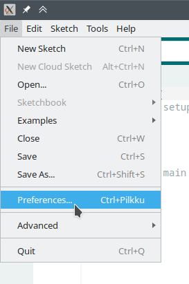

# Sääasema-projekti

Sääasemaprojektin NodeMCU-sääasemat seuraavat
[ThingPulse IoT Electronics Starter Kit](https://thingpulse.com/product/esp8266-iot-electronics-starter-kit-weatherstation-planespotter-worldclock/)-paketin
ohjeita.

- [Pdf-opas](https://blog.squix.org/weatherstation-guide)
- [Github repositorio](https://github.com/ThingPulse/esp8266-weather-station)

## Ohjeet

Tämä repositorio koostuu useampaan hakemistoon koostetuista pienemmistä ohjelmista,
joilla voi tutustua NodeMCU:n ja eri modulien käytön ohjelmointiin sekä
niistä yhdistelemällä tehdystä sääaseman koodista.

Aloita lukemalla alla oleva selostus käytettävistä osista ja Arduino IDE:n asentamisesta.
Jatka sen jälkeen osaamisesi, kiinnostuksesi ja tarpeidesi mukaan osaohjeilla tai siirry
lopullisen sääaseman koodiin.

- [01_dht11](01_dht11): Ohjelmien rakenne, kirjastot, Serial Monitor ja DHT11-sensorin käyttö.
- [02_oled](02_oled): Oled-näytön (SSD1306) käyttö, kirjasto, toiminnot ja esimerkki (i2c-protokolla)
- [02_oled_spi](02_oled_spi): Oled-näytön (SSD1306) käyttö, kirjasto, toiminnot ja esimerkki (spi-protokolla)
- [03_ws_oled](03_ws_oled): Säätietojen näyttö oled-näytöllä.
- [04_wifi](04_wifi): WiFi-piirin käyttö, kirjastot, yhteyden luonti (suojaamaton yhteys)
- [04_wifi_https](04_wifi_https): WiFi-piirin käyttö, kirjastot, yhteyden luonti (suojattu yhteys)
- [05_ntp](05_ntp): Haetaan NTP-aika verkosta ja näytetään näytöllä.
- [06_ws](06_ws): Sääasema, joka näyttää säätiedot ja kellonajan näytöllä.
- wsThinkSpeak: Sääasema, joka näyttää säätiedot ja kellonajan näytöllä ja lähettää dataa ThinkSpeak-palveluun.

## Osat

- NodeMCU V2 ESP8266 micro controller
- OLED display (128×64)
- DHT11 Sensor (temperature and humidity)
- Johtoja
- Usb-johto

## Mikro-kontrolleri

Ohjelmoitavana piirinä on NodeMCU-piiri, joka sisältää ESP8266-WiFi-piirin
verkkoyhteyksiä varten. Sen ohjelmointi tapahtuu Arduino IDE -ympäristössä C++-kielellä.

## Kokoaminen

Osat voi koota joko koekytkentäalustalle tai suoraan yhdistämällä osat johdoilla.
Koska osia on vain kolme, voi niiden yhdistäminen suoraan johdoilla olla
yksinkertaisempi ratkaisu.

OLED-näyttö ja DHT11-sensori kytketään NodeMCU-piiriin oheisten kuvien mukaisilla
kytköksillä.

### DHT11-kytkentä

DHT11-sensorin johdotus:

| DHT11  | NodeMCU | Kuvaus        | Väri |
|--------|---------|---------------|------|
| VCC (+)| 3v3     | Virta, 3.3V   | Punainen |
| GND (-)| GND     | Maa           | Musta    |
| DAT    | D6      | Data          | Keltainen|

### Oled-näytön kytkentä

OLED-näyttö käyttää i2c-protokollaa. Johdotuksena:
| Näyttö | NodeMCU | Kuvaus        | Väri |
|--------|---------|---------------|------|
| VCC    | 3v3     | Virta, 3.3V   | Punainen |
| GND    | GND     | Maa           | Musta    |
| SCL    | D4      | Kello         | Vihreä   |
| SDA    | D3      | Data          | Keltainen|

Jos osat (näyttö ja sensori) on ostettu eri paketissa tai eri kaupasta, niiden
liittimissä, merkinnöissä tai järjestyksessä voi olla eroa. Katso tarkkaan!

### Oled-näytön kytkentä, jos spi

Esimerkiksi erikseen ostettu näyttö voi olla mallia, jossa on enemmän
liittimiä kuin kuvan neljä. Tällaiset tukevat usein i2c-protokollan lisäksi
spi-protokollaa. Silloin kannattaa varmistaa, kumpi on valittuna ja rakentaa
sen mukaan, ellei halua muuttaa valintoja.

SPI-protokollalla kytkentä voi olla esimerkiksi seuraava:

OLED-näyttö käyttää i2c-protokollaa. Jodotuksena:
| Näyttö | NodeMCU | Kuvaus        | Väri |
|--------|---------|---------------|------|
| VCC    | 3v3     | Virta, 3.3V   | Punainen |
| GND    | GND     | Maa           | Musta    |
| DIN    | D7      |               | Sininen  |
| CLK    | D5      | Kello         | Vihreä   |
| CS     | D8      |               | Valkoinen|
| D/C    | D2      |               | Oranssi  |
| RES    | D1      |               | Keltainen|

## Arduino IDE

Ohjelmointi tehdään Arduino IDE -ohjelmointiympäristöllä, joka sisältää koodin kirjoittamiseen käytettävän editorin, tarvittavien kirjastojen ja muiden asetusten asentamistyökalut sekä toiminnot ohjelman kääntämiseen, siirtämiseen mikrokontrolleriin sekä tulosteiden tarkasteluun.

Arduino IDE:n voi ladata [Arduinon kotisivulta](https://www.arduino.cc/en/software).
Itse IDE:n asentamisen jälkeen pitää asentaa vielä tuki halutulle mikrokontrollerille
ja valita se käyttöön.

Ensin pitää Arduino IDE:n asetuksiin lisätä osoite, josta esp8266-piiriä käyttävien
kontrollereiden asetukset haetaan. Lisätään kuvan osoittamaan kohtaan osoite:

http://arduino.esp8266.com/stable/package_esp8266com_index.json

Tämän jälkeen Arduino IDE:en on asennettavissa tuki esp8266-piiriä käyttäville
mikrokontrollereille. Avataan "Boards manager".

Boards managerissa kirjoitetaan hakukenttään `esp8266` ja asennetaan löytyvä paketti.

Nyt valitaan ohjelmoitava piiri.

Piiriksi valitaan `NodeMCU 1.0` ja portiksi se portti, johon piiri on yhdistetty.
Linuxissa tämä saattaa olla esimerkiksi `/dev/ttyUSB0` ja Windowsissa esimerkiksi `COM3`.
Tässä kohtaa kannattaa myös varmistaa, että käyttäjällä on kirjoitusoikeus käytössä
olevaan porttiin. Esimerkiksi Ubuntu Linuxissa `/dev/ttyUSB0`-laitteeseen on kirjoitusoikeus
ryhmään `dialout` kuuluvilla käyttäjillä. 

Nyt olemme valmiit aloittamaan piirin ohjelmoinnin.