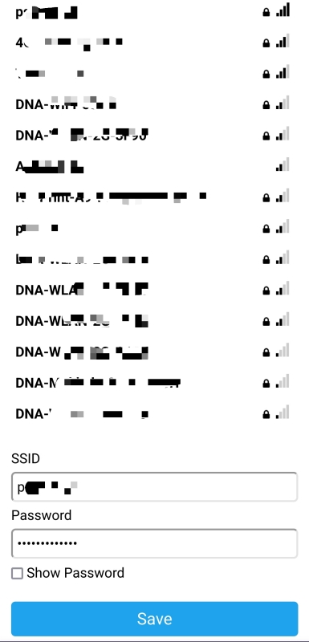

# Sarjasyöte ThingSpeakiin

Tämä NodeMCU-piirillä ajettava koodi lukee pinneihin D2 (read) ja D3 (transmit)
kytketystä laitteesta (Micro:bit) lähetettyä sarjadataa ja lähettää sen ThingSpeak-palveluun.

## Kytkentä

| Micro:bit | NodeMCU |
|-----------|---------|
| tx        | D2      |
| rx        | D3      |
| gnd       | Gnd     |
| vcc       | 3.3V    |

(Virrat kytketään yhteen, jos laitteista toinen syöttää virtaa toiseen. Tarvittavan volttimäärän mukaan.)

## Kirjastot

Koodi käyttää [WiFiManager](https://github.com/tzapu/WiFiManager)-kirjastoa, joka täytyy lisätä Arduino IDE:en ennen ohjelman kääntämistä.

## Asetukset

Verkon asetukset ja ThingSpeakin avaimet pitää laittaa tiedostoon `settings.h`.
Kopioi pohjana oleva tiedosto `settings.h.template` tälle nimelle ja
täytä sinne oikeat tiedot.
```c++
// NodeMCU:n oman tukiaseman tiedot
// Yhdistä laitteeseen näillä tukiasematiedoilla ja valitse käytettävä wifi-verkko.
const char* ap_ssid = "<ssid tähän>";
const char* ap_password = "<salasana tähän>";

// ThingSpeak
// Vaihda tähän ThinkSpeakin kanavan tiedot ja avaimet.
unsigned long channelID = <kanavan numero>;
const char* writeAPIKey = "<kirjoitus api-avain>";
const char* readAPIKey = "<luku api-avain>";

// ThingSpeakin asetuksia päivitystiheys
const unsigned long postingInterval = 120L * 1000L; // 2 minutes
```

## WiFi-verkko

Kun laite käynnistetään ensimmäisen kerran tai jos se ei saa yhteyttä
tallennettuun verroon, sen wifi käynnistuu tukiasematilaan.
Laite näkyy tukiasemana, jonka ssid on tiedostossa `settings.h` määritelty
muuttujaan `ap_ssid`. Salasanana on samassa tiedostossa olevan
muuttujan `ap_password` arvo. Tukiasemaan voi yhdistää puhelimella tai tietokoneella,
minkä jälkeen selaimella voi mennä osoitteeseen `192.168.4.1`.
Sieltä voi valita tarjolla olevista verkoista halutun ja syöttää sen salasanan.
Tämän jälkeen laite yrittää yhdistää valittuun verkkoon ja alkaa suorittaa
`loop()`-funktiota.




Seuraavalla käynnistyksellä laite yhdistää automaattisesti samaan verkkoon,
joka valittiin. Jos verkko ei ole saavutettavissa, laite siirtyy taas tukiasematilaan
ja verkon voi valita uudelleen.


## Sarjadatan nopeus

Tällä koodilla sarjaliitännästä luetaan nopeudella 4800 baud.
```c++
s.begin(4800);
```
Tämä on riittävä nopeus, mutta **varmista, että lähettävän pään (Micro:bit)
lähettää samalla nopeudella**.

## Datan muoto

Sarjadata tulee tekstiriveinä muodossa, jossa on pilkuilla eroteltuina
ensin rivin otsikko ja sitten lukuarvoja. Esimerkiksi:
```
"test",25.88,1000.48,131.74,32.47
```

## Datan lukeminen

Funktiossa `loop()` luetaan sarjadata rivi kerrallaan ja tulkitaan siitä arvot.
Ensin poistetaan alusta ensimmäisenä oleva teksti ja sen jälkeen luetaan kukin
lukuarvo muuttujaan. Esimerkiksi:
```c++
// Parse 1st value
token = strtok(NULL, ",");
float val1 = atof(token);
```

Muuttujia luetaan enintää 8 kpl. Ota kommentointi pois riittävästä määrästä rivejä.

## Datan lähettäminen

Luetut datat lisätään kukin kenttä `ThingSpeak`-olioon riveillä:
```c++
ThingSpeak.setField(1, val1); // Kenttä 1
```

Ota kommentointi pois riittävästä määrästä rivejä.

Lisätyt kentät lähetetään ThingSpeak-palveluun rivillä:
```c++
int writeSuccess = ThingSpeak.writeFields( channelID, writeAPIKey );
```
