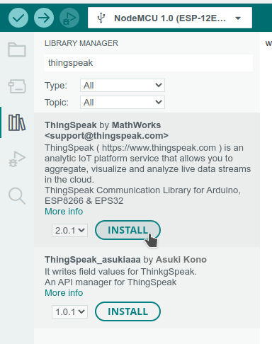

# Sääasema ThingSpeak-yhteydellä

Lisätään näytölle tulostavaan sääasemaan ([06_ws](../06_ws/))
yhteys [ThingSpeak](https://thingspeak.com)-palveluun.

## ThingSpeak

ThingSpeak on palvelu, johon IoT-laitteilta voi lähettää dataa talteen, analysoitavaksi
ja havainnollistettavaksi.

Palveluun voi tehdä tunnukset ja käyttää sitä ilmaiseksi, jos ei lähetä sinne dataa
liian paljon ja tiheään. Tunnuksen luonnin jälkeen palveluun voi luoda kanavan
datan tallentamista varten. Kanavia voi olla samalla käyttäjätunnuksella useampia,
esimerkiksi eri laitteille. Kanavan asetuksista valitaan
- Kanavan nimi
- Kanavan kuvaus
- Enintään 8 käytettävää datakenttää ja niiden nimet
- Valinnaisesti laitteen sijainti
- Valinnaisesti video aiheesta

Kanavan luontiin opastaa palvelun [tutoriaalisivu](https://se.mathworks.com/help/thingspeak/collect-data-in-a-new-channel.html).

Palvelusta voi myös valita kanavan julkisuuden ja kanavan dashboardissa näytettävät
kuvaajat tai muut "widgetit". Erikseen käyttäjän omaan näkymään sekä mahdolliseen
julkiseen näkymään.

Datan palveluun lähettämiseen tarvittavat API-avaimet voi luoda kanavan
"API Keys" -välilehdellä.

## Kirjastot

Edelliseen ohjelmaan verrattuna on lisätty ThingSpeak kirjasto, joka löytyy
"Library Managerista" hakusanalla "thingspeak".



Koodissa kirjasto ladataan ja tarvittavat globaalit muuttujat asetetaan rivillä:
```c++
#include <ThingSpeak.h>
char thingSpeakAddress[] = "api.thingspeak.com";
unsigned long lastConnectionTime = 0;
long lastUpdateTime = 0;
```

Lisäksi edellisten osien tavoin verkkoasetukset sekä ThingSpeakin omat asetukset
laitetaan erilliseen `settings.h`-tiedostoon, jolle löytyy pohja tiedostosta
`settings.h.template`.

ThinkSpeakin asetuksiin tarvitaan kanavan id-numero, joka löytyy kanavan
osoitteen lopusta, sekä API-avaimet kirjoitusta ja lukemista varten.
Tämä ohjelma tosin käyttää vain kirjoitusavainta.

Lisäksi asetuksissa annetaan muuttujanimet kolmelle datakentän numerolle.
Jos kenttiä tarvitaan enemmän tai vähemmän, näitä voidaan muuttaa.


## Ohjelma

Ohjelma on muuten samanlainen kuin [06_ws](../06_ws/), mutta lisäksi siinä ovat
toiminnallisuudet datan lähettämiseksi ThingSpeak-palveluun.
Ensin pitää käynnistyksen yhteydessä `setup()`-funktiossa muistaa
alustaa `ThingSpeak`-olio antamalla sille toimiva verkkoyhteys.
```c++
ThingSpeak.begin(client);
```
Funktiossa `loop()` puolestaan kutsutaan uutta funktiota `write2TSData()`,
jolla data lähetetään ThinkSpeak-palveluun. Tämä tehdään vain, kun riittävän pitkä
aika edellisestä lähetyksestä on kulunut.

```c++
if (millis() - lastUpdateTime >= postingInterval) {
    // Jos edellisestä lähetyksestä on riittävästi aikaa, lähetetään ThingSpeakiin.
    lastUpdateTime = millis();
    int reply = write2TSData( channelID, dataFieldTemp, temperature, dataFieldHum, humidity, dataFieldTime, millis());
    // Tulostetaan sarjakonsoliin, debuggausta varten.
    Serial.print("ThingSpeak vastasi: ");
    Serial.println(reply);
}
```

Tässä esimerkissä lähetetään kolme kenttää: Lämpötila, ilmankosteus sekä "uptime".
"Uptime" on on laitteen käynnissäoloaika millisekunteina.

## Data ThingSpeakissa

Data näyttää ThingSpeak-palvelun kanavana esimerkiksi tältä:
https://thingspeak.com/channels/2100580

Kanavan datan voi ladata csv-, xml- tai json-muodossa käsittelyä ja tarkastelua varten.
Jos MatLab-ohjelmistoon on lisenssi, sitä voi käyttää myös ThinkSpeakissa datan
analysointiin.