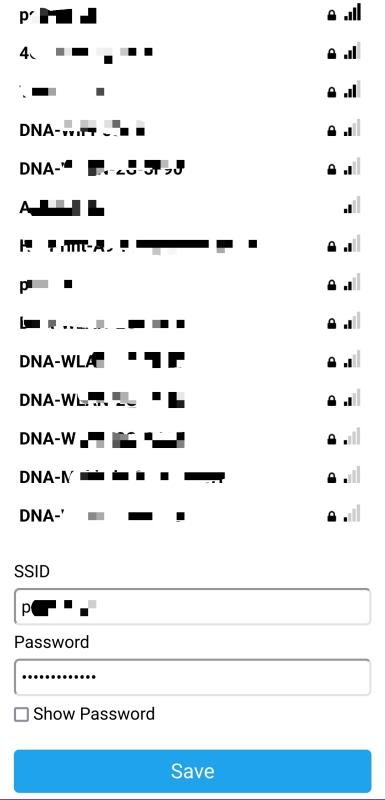

# Sääasema ThingSpeak-yhteydellä ja WiFiManagerilla

Tämä on muuten sama versio kuin ([wsThingSpeak](../wsThingSpeak/)),
mutta tähän versioon on WiFiManager, jotta sääasema on helpompi asettaa
käyttämään eri WiFi-verkkoa tarvitsematta kovakoodata verkon SSID:tä ja
salasanaa.

WiFiManager toimii siten, että jos sillä ei ole muistiin tallennettuna
wifi-verkon tietoja, se käynnistää oman tukiaseman, johon voi liittyä
tietokoneella tai puhelimella, sekä verkkosivun, jolla voi valita
jonkin kuuluvilla olevan wifi-verkon käytettäväksi.

## Kirjastot

Edelliseen ohjelmaan verrattuna on lisätty WiFiManager kirjasto, joka löytyy
"Library Managerista" hakusanalla "wifimanager".

Koodissa kirjasto ladataan ja tarvittava globaali muuttuja asetetaan riveillä:
```c++
#include <WiFiManager.h>

WiFiManager wifiManager;
```

Lisäksi suoraan koodiin on lisätty muuttujina WiFiManagerin tarvittaessa
käynnistämän tukiaseman SSID ja salasana. (Näitä ei ole piilotettu `settings.h`-tiedostoon.)

```c++
// NodeMCU:n oman tukiaseman tiedot
// Yhdistä laitteeseen näillä tukiasematiedoilla ja valitse käytettävä wifi-verkko.
const char* ap_ssid = "kerlu_wstation";
const char* ap_password = "klws-rokn4_3";
```

## Ohjelma

Ohjelmaan on lisätty ns. callback-funktio, joka suoritetaan, kun
WiFiManager ei ole onnistunut yhdistämään muistettuun verkkoon ja
se on käynnistänyt oman tukiasemansa verkon valitsemista varten.
Tämän funktion tarkoitus on vain näyttää käynnistetyn tukiaseman tiedot
ja verkonvalintasivun osoite oled-näytöllä sekä sarjakonsolissa.

```c++
/**
 * Jos mennään tukiasematilaan, tulostetaan konsoliin ja näytölle SSID ja ip-osoite.
 **/
void configModeCallback(WiFiManager *myWiFiManager) {
    Serial.println("Access Point mode");
    Serial.println(WiFi.softAPIP());
    Serial.println(myWiFiManager->getConfigPortalSSID());
    // Näytetään ip-osoite näytöllä.
    display.drawString(10, 16, "Access Point mode:");
    display.drawString(10, 26, myWiFiManager->getConfigPortalSSID());
    display.drawString(10, 36, ap_password);
    display.drawString(10, 46, WiFi.softAPIP().toString());
    display.display();
}
```

Verkkoon yhdistävässä `connectNetwor()`-funktiossa yhdistäminen tehdäänkin nyt
vain kertomalla ensin, mikä funktio suoritetaan tukiasematilaan päädyttäessä
sekä käynnistämällä yhteyden luonti `autoConnect()`-metodilla.

```c++
// Kerrotaan, mikä funktio suoritetaan, jos WiFiManager menee tukiasematilaan.
wifiManager.setAPCallback(configModeCallback);
// Yhdistetään verkkoon WiFiManagerilla
wifiManager.autoConnect(ap_ssid, ap_password);
```

Muilta osin ohjelma on samanlainen kuin aiempi versio [wsThingSpeak](../wsThingSpeak/).

## WiFi-verkkoon yhdistäminen

Kun laite käynnistetään ensimmäisen kerran tai jos se ei saa yhteyttä
tallennettuun verkkoon, sen wifi käynnistuu tukiasematilaan.
Laite näkyy tukiasemana, jonka ssid on  määritelty
muuttujaan `ap_ssid`. Salasanana on muuttujan `ap_password` arvo.
Laite näyttää nämä molemmat oled-näytöllä, jos se päätyy tukiasematilaan.

Tukiasemaan voi yhdistää puhelimella tai tietokoneella,
minkä jälkeen selaimella voi mennä osoitteeseen `192.168.4.1`.
Sieltä voi valita tarjolla olevista verkoista halutun ja syöttää sen salasanan.
Tämän jälkeen laite yrittää yhdistää valittuun verkkoon ja alkaa suorittaa
`loop()`-funktiota.




Seuraavalla käynnistyksellä laite yhdistää automaattisesti samaan verkkoon,
joka valittiin. Jos verkko ei ole saavutettavissa, laite siirtyy taas tukiasematilaan
ja verkon voi valita uudelleen.
